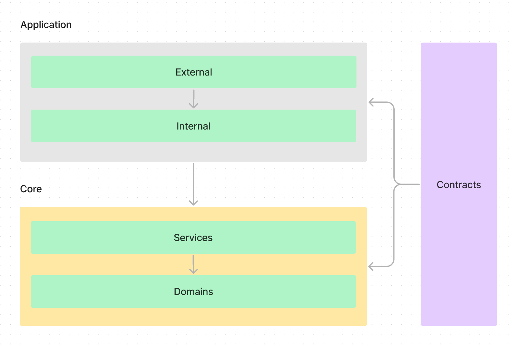

# Nubank Code Challenge

## Como desenvolvi
- **TDD**: Antes de tudo, escrevi os casos de teste unitário baseado nos cases da documentação.
- **Regras de negócio**: O projeto foi totalmente pensado para isolar o máximo possível das regras de negócio, de estruturas comumente mais mutáveis, como qual será a ferramenta para capturar o input de dados.
- **Refatorações contínuas**: Primeiro empreguei os conhecimentos base que tenho para desenvolver o código, após isso fui realizando refatorações principalmente para utilizar de conceitos da `programação funcional`
  - Eliminar o estado mutável de classes.
  - Usar funções puras que recebem todos os dados como parâmetros e retornam novos valores.
  - Aplicar métodos funcionais como map, reduce, filter.
- **Orientação a Objetos e Programação Funcional**: Acho que a orientação a objeto misturado com conceitos de programação funcional pode ser bem útil, gosto muito de utilizar estruturas como classes e interfaces para definir padrões de design de código, e utilizar o conceito de imutabilidade para poder ter um código mais previsível e seguro.
  
## Tecnologias
### Deno
Utilizei o deno como runtime para facilitar o processo de execução e testes, pois o Deno interpreta o Typescript diretamente, sem passar pelo processo de transpilação para Javascript e logo em seguida é interpretado pelo Node.

### Typescript
Decidi pelo uso do Typescript pois a tipagem estática me ajuda a ter mais segurança na implementação de interfaces e manter a segurança entre contratos

### Docker
No nosso caso, optei por usar o Docker para isolar o ambiente de execução

## Design de Código
Me inspirei em arquiteturas como **Hexagonal Architecture** e **Clean Architecture**, mas não adicionei todas as camadas necessárias, pois isso iria complexificar extremamente o projeto.
Então decidi isolar bastante a camada de negócio (`core`) utilizando `dependecy inversion`, e simplificar as camadas superiores.



### Application

#### External
Nela coloquei a ferramenta de CLI, pois ela serve apenas para capturar o input de dados, isso deve ser fácilmente substituível.

#### Internal
Aqui temos apenas a controller, ela serve para conversão de dados de input, para o uso interno da aplicação, e modelos internos para output.

### Core

#### Services
Possui regras de negócio e conduz fluxos de dados utilizando dos domínios.

#### Domais
Modelo de dados com validações específicas do domínio.

## Rodar projeto
Para ler todos os arquivos que foram pré inseridos para facilitar o processo, rode esse comando
```bash
bash ./entrypoint.sh
```

ou 

```bash
./entrypoint.sh
```

Caso queira informar algum arquivo na sua máquina, pode rodar esse comando
```bash
bash ./entrypoint.sh --file="INPUT_FILE.txt"
```

ou 

```bash
./entrypoint.sh --file="INPUT_FILE.txt"
```

> **Detalhe muito importante**, o arquivo precisa estar no diretório do projeto

## Rodar testes unitários

Para rodar os testes unitários, rode esse comando: 
```bash
bash ./tests.sh
```
